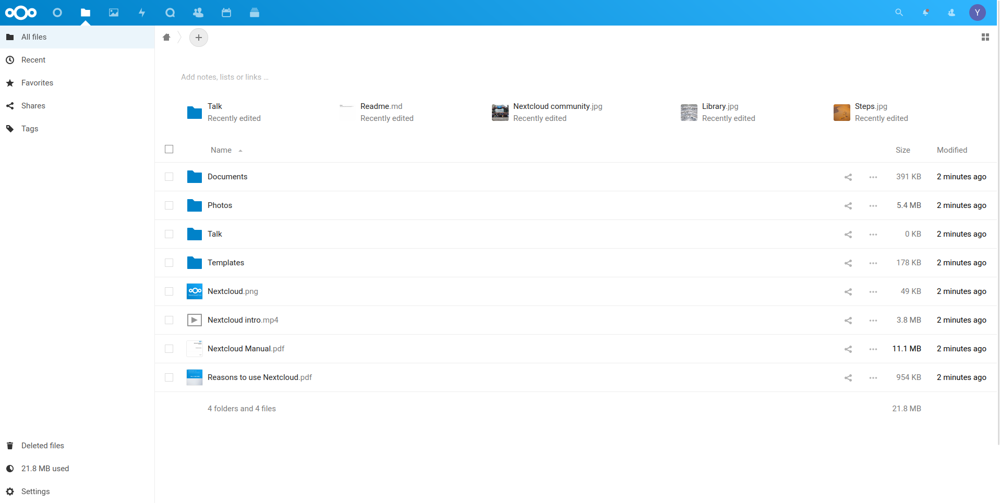
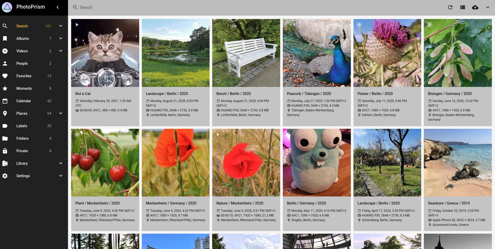
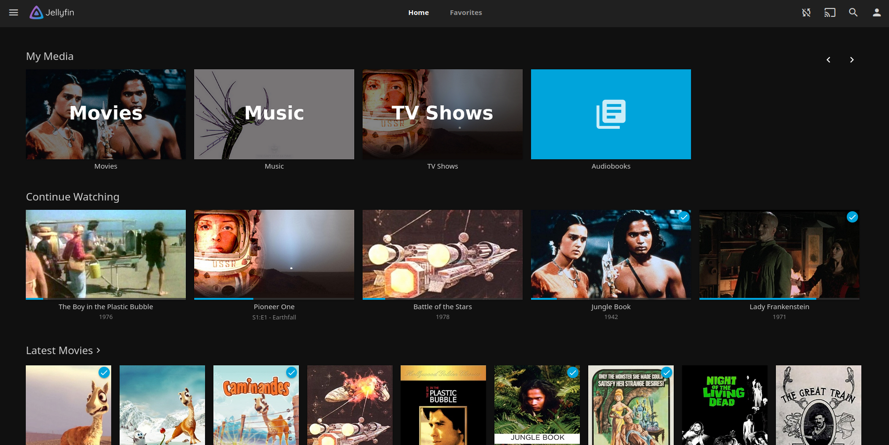
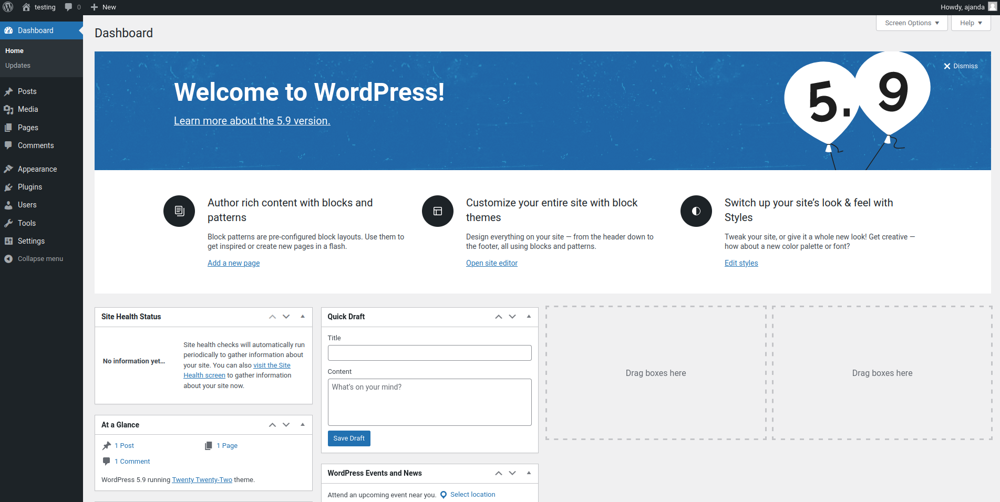
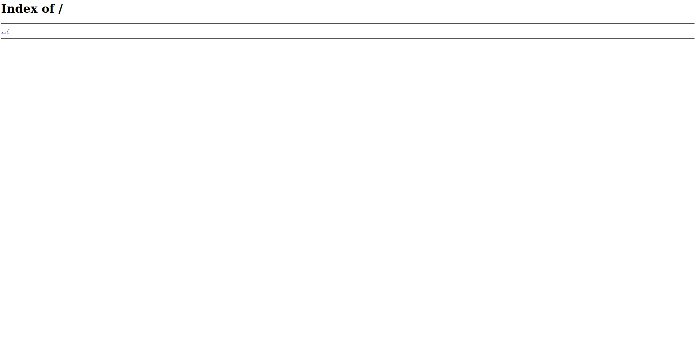
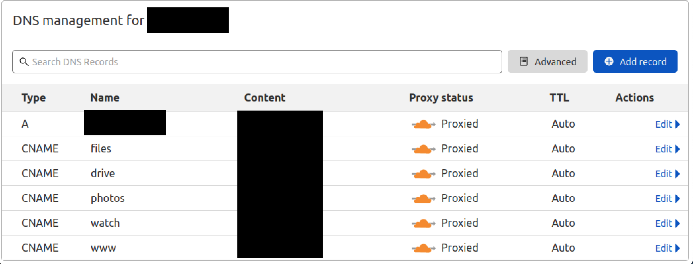
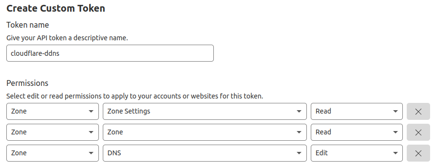

# MyCloud

This is a template of a personal cloud setup using docker swarm. It replaces many of the most common services cloud providers provide and can all be self hosted on your own personal home server.

This has a couple of advantages. Namely, that your data stays with you and is not shared with others. It is also significantly cheaper than paying a monthly subscribtion fee for cloud storage.

Setting up a server is as easy as building a cheap desktop computer or using an old one you have lying around. To this you can add in a few drives (ideally NAS specific drives in a RAID configuration) depending on your storage needs. Then you'll want to ideally install linux and connect it via ethernet to your home router.

Additionally, you'll have to purchase a domain name and point it to your home IP. This template heavily relies on using [Cloudflare](https://www.cloudflare.com) as your DNS provider but can easily be adapted to any other.

## Services

Here is a list of the different services that are deployed with this project. For services which do not interest you, you can easily remove them from the project.

### [Nextcloud](https://nextcloud.com/)

Nextcloud is an open source alternative to google drive and iCloud. It stores and syncs your files accross devices and allows you to easily access them in one central place anywhere in the world on any device. Try it out for yourself with this [demo](https://try.nextcloud.com/).



### [Photoprism](https://photoprism.app/)

Photoprism is an open source alternative to google photos and iCloud photos. It has a really clean interface and loads extremely quickly. It also supports auto captioning and face recognition. It is by far the best open source photo solution I have seen yet and is actively being developed. Try it out for yourself with this [demo](https://demo.photoprism.app)



### [Jellyfin](https://jellyfin.org/)

Jellyfin is an open source alternative to video streaming services such netflix or Plex or Kodi. It allows you to store and stream your own personal media. Try it out for yourself with this [demo](https://demo.jellyfin.org/stable)



### [Wordpress](https://wordpress.org/)

Wordpress is one of the most popular content management platforms for websites. Its great for building personal or corporate websites without having to get into web development.



### [Nginx](https://nginx.org/en/)

Nginx is an HTTP server that can host websites and also act as a reverse proxy. In this projet, I use it as a way to host read only files that are viewable in the browser and also fetchable using commong commands like `wget` in linux.



## Setup

These step by step instructions are meant to allow anyone to quickly get setup on their 

### Domain & DNS

This project assumes that you're using Cloudflare as your DNS provider. This is because it uses it to dynamically update your DNS whenever your home IP changes. It also uses the generated certificates.

Once your domain has been added to Cloudflare, you'll have to generate new CNAME records with the following subdomains: www, drive, photos, watch, files. It should look like this:



**Note:** that it may take some time for these settings to propogate. Sometimes this takes as long as a whole day.

### Setup Security & Generating certificates

Go to the SSL/TLS tab and set your encrption mode to **Full (strict)**. Then go to origin server and click **Create Certificate**. Use the PEM format and copy the certificate into a text file with the the format `<domain>.cert` where `<domain>` is the root name of your domain (e.g. for mycloud.com the file would be called mycloud.cert). Now do the same thing for the key and store that in a file `<domain>.key`. Keep these safe somewhere, we will need them later.

### Get API key

To enable Dynamic DNS updates, we will use the cloudflare web api. For this you just need to get your api key. To do this, go to your cloudflare dashboard, in the top right click on the account icon, then on **My Profile**. Go to the **API Tokens** tab and click **Create Token**. Name it cloudflare-ddns and set the permissions to the following:



Copy this key to a textfile called `cloudflare_api_key` and keep it somewhere safe for now.

### Update Tags

Its good practice to always set the versions of your services so that they do not change between deployments. Depending on when you come across this project, it maybe that the images are vastly out of date. If that is the case, look up the latest version and replace the version tags on the images in the docker-compose file in the format `image:\<tag\>`.

### Set Your Domain

Set your domain by replacing all `<domain>` and `<com>` with your domain in the form `<domain>.<com>`.

### Generating Secrets

Secretes that you have to create

- `<domain>`.cert
- `<domain>`.key
- clouflare_api_key
- nextcloud_db
- nextcloud_db_user
- nextcloud_db_password
- wordpress_db
- wordpress_db_user
- wordpress_db_password

**Note:** Currently photoprism does not support secrets for its admin password. This is has been submitted as a [feature request](https://github.com/photoprism/photoprism/issues/1987). For now you'll have to replace `<photoprism_admin_password>` with your intented password

### Setting up Docker Swarm

### Setting up Network Interface

### Create folders

```bash
bash init.sh
```

### Running


## Performance Tips

if you have a faster solid state drive, you can store the databases (change the volume bindings in the docker-compose file)

